This is going to be a walkthrough of one of the LAB I did in Udemy to build Serverless Workflow in AWS. The task of the LAB was to take any JSON file uploaded in S3 bucket and store the data from that in DynamoDB.

Thing it covers:
- Efficiently process AWS S3 events using AWS SQS Message Queues.
- Trigger AWS Lambda Function to process the message in SQS queue.
- We can process the file in AWS Lambda Function if required.
- Store the data to AWS DynamoDB. This is written throught the AWS Lambda Funtion.
- IAM Role can be used to manage access.

## Creating S3 bucket for storing files

- Navigate to [console.aws.amazon.com/console/home](console.aws.amazon.com/console/home)
- Click "Services"

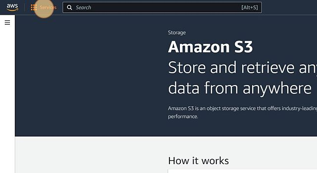

- Click "Storage"

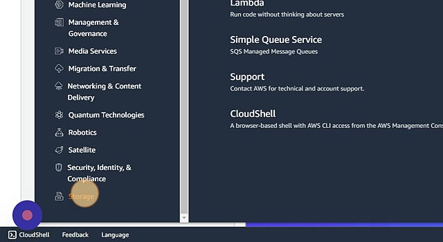

- Click "S3"

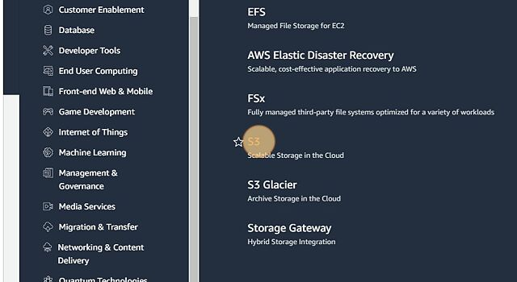

- Click "Create bucket"

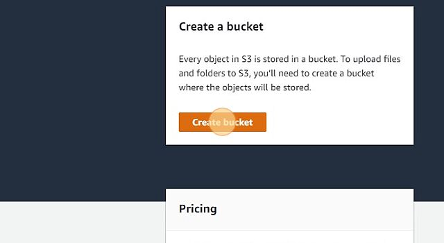

- Give some unique name for bucket like "json-processing-bucket"

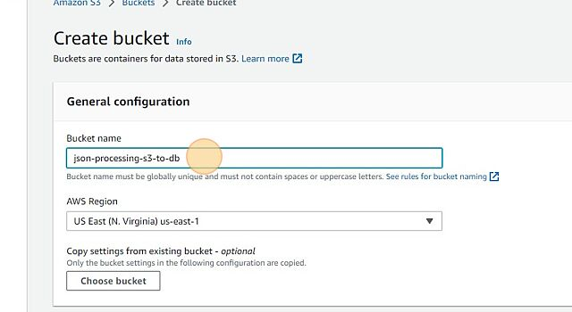

- Click "Create bucket"

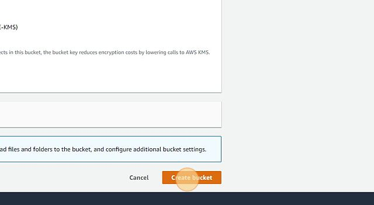


## Creating Table in DynamoDB

- Navigate to [console.aws.amazon.com/console/home](console.aws.amazon.com/console/home)
- Click "Services"

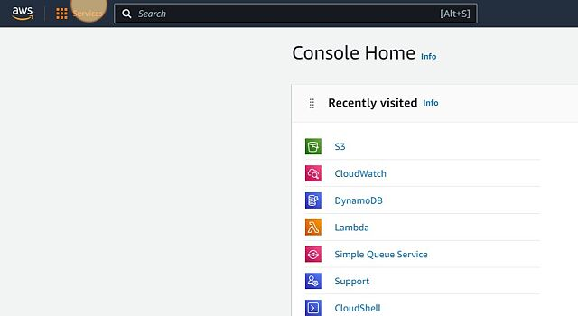

- Click "Database"

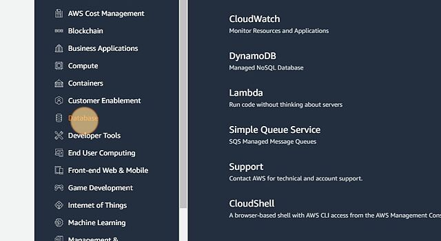

- Click "DynamoDB"

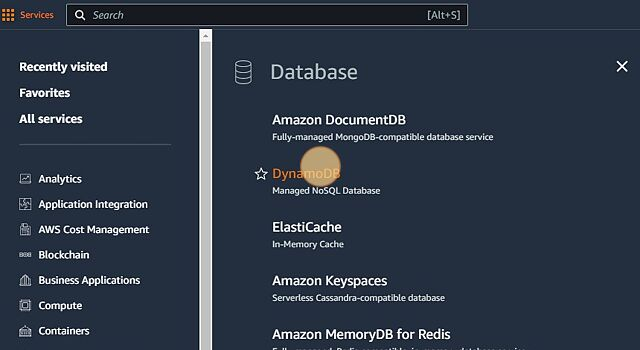

- Click "Create table"

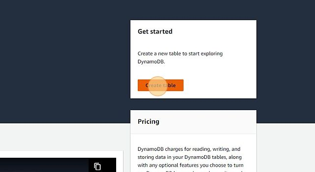

- Give some unique name for DB Table like "JSONItemTable" and provide a primary key like "id". This will be later used to update data via the AWS Lambda function.

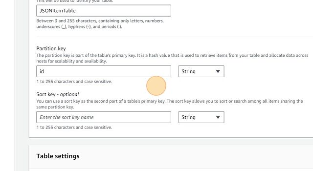

- Click "Create table"

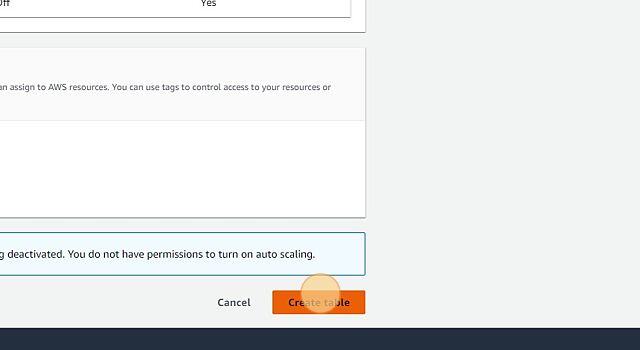

## Create Lambda Function

### Create role for Lambda Function

Before creating Lambda Function we can set role and limit access to what this lambda funtion can do. Basically we want this Lambda Function to:
- Have read access to S3 bucket -> This is possible via **AmazonS3ReadOnlyAccess**
- Receive message form SQS -> This is possible via **AWSLambdaSQSQueueExecutionRole**
- Have write access to Dynamo DB -> **AmazonDynamoDBFullAccess**
- Have write access to CloudWatch in case we want to debug -> **AWSLambdaBasicExecutionRole**

To create this role

- Click "Services"

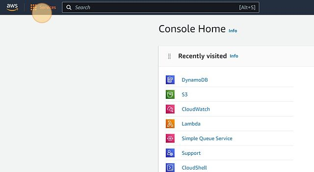

- Click "Security, Identity, & Compliance"

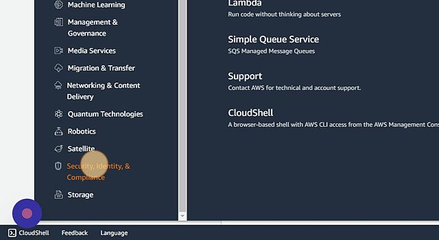

- Click "IAM"

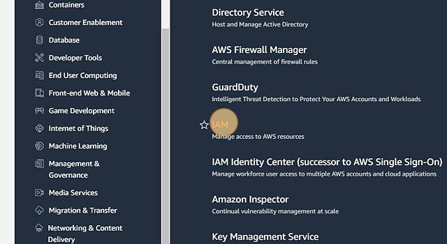

- Click "Roles"

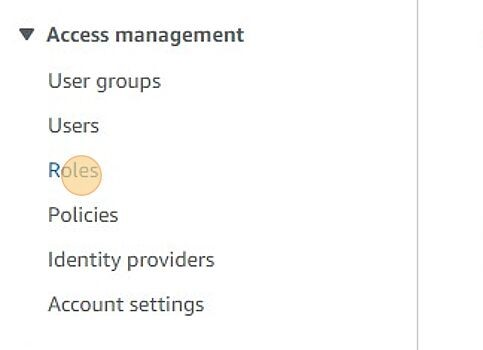

- Click "Create role"

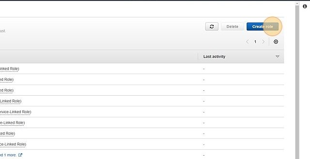

- Select "AWS Service" and the "Lambda"

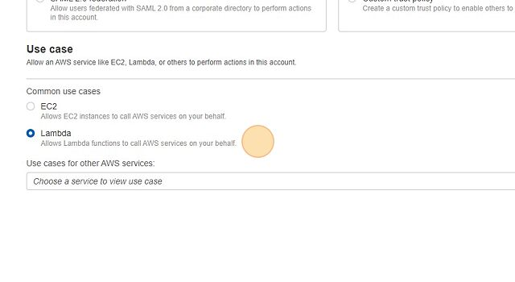

- Click "Next"
- Filter the roles. You can filter with this "AmazonS3ReadOnlyAccess|AWSLambdaSQSQueueExecutionRole|AmazonDynamoDBFullAccess|AWSLambdaBasicExecutionRole"

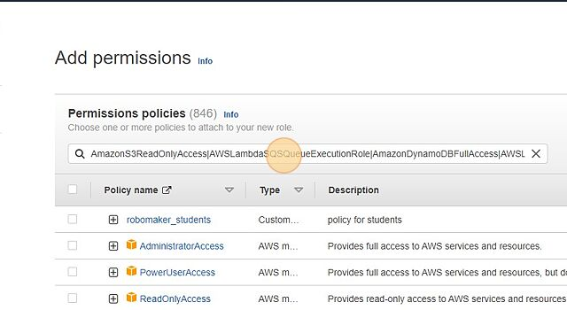

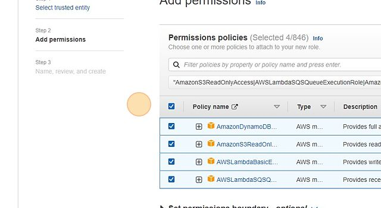

- Click "Next"

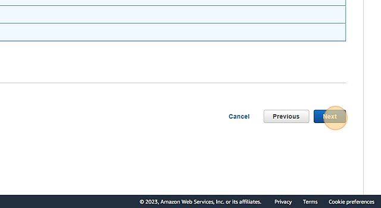

- Provide a name to the role like "LambdaRoleForJSONItems"

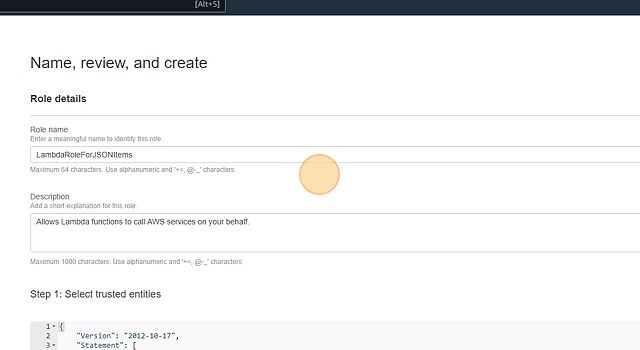

- Click "Create role"

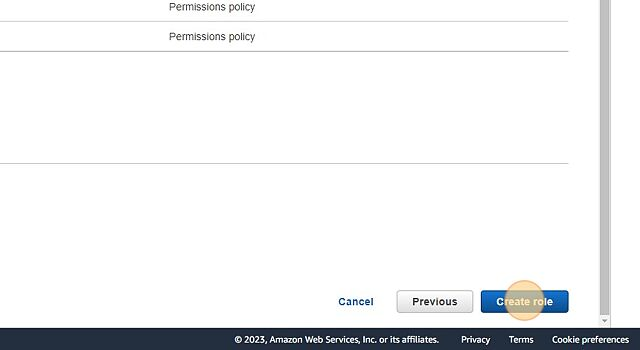

### Create Lambda Function

- Click "Services"

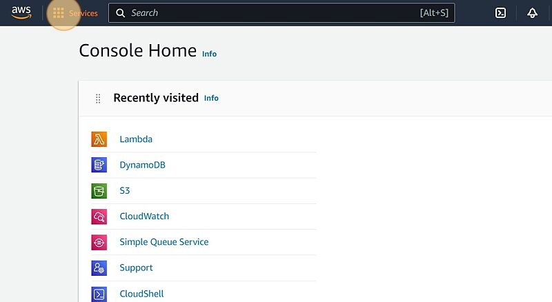

- Click "Compute"

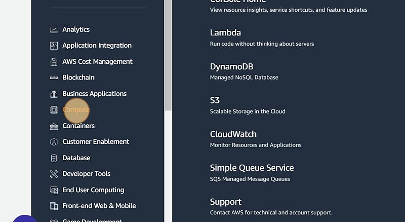

- Click "Lambda"

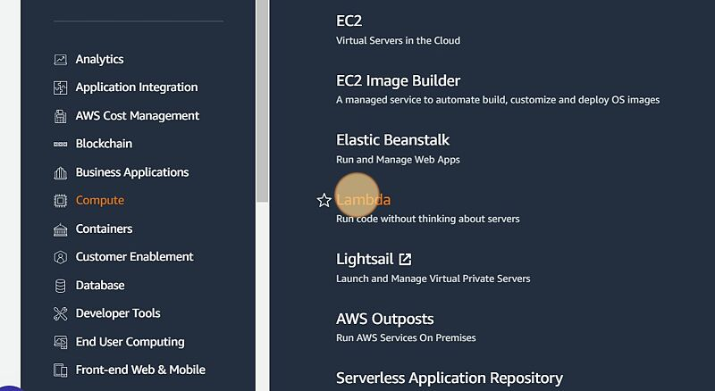

- Click "Create function"

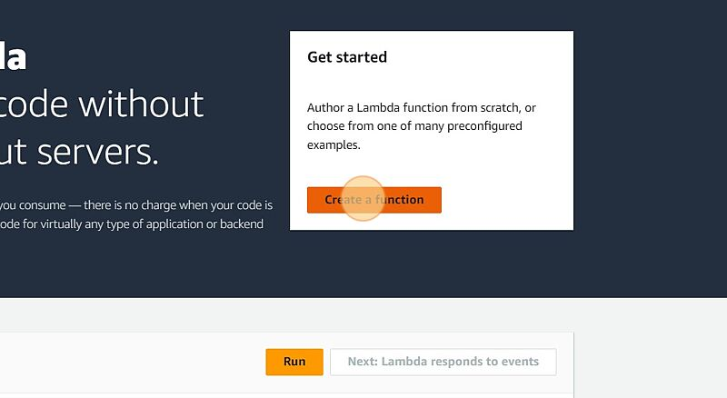

- Click "Author from scrach"

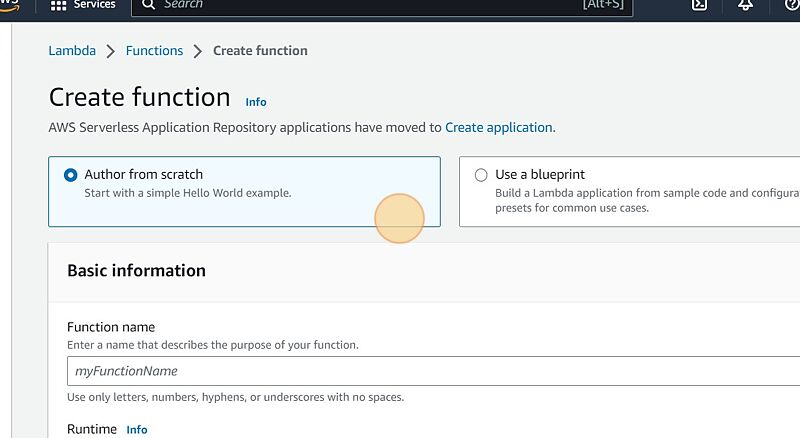

- Provide a Function name. Here I am calling it "JSONProcessingLambdaFunctionTriggeredBySQS". Also I am going to use Python as Runtime.

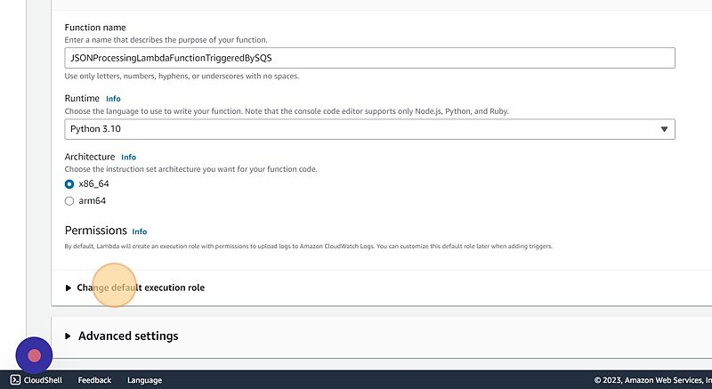

- Now we can use the role which we created and link it with this Lambda Function.

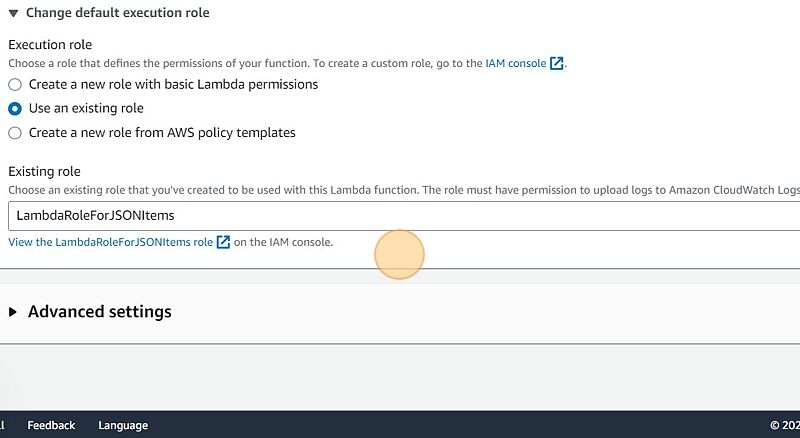

- Click on "Create function"

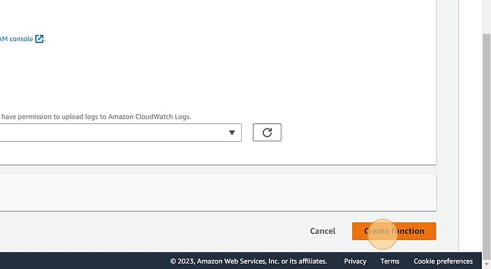

- Next screen we can add the Lambda "Code". I am going to add the Python Code. It is well documented.

Please open the code block below to view the complete code.

```python
import json
import logging
import random

import boto3

sqs_client = boto3.client('sqs')
dynamo_client = boto3.resource('dynamodb')
s3_client = boto3.client('s3')

# Set up logger
logger = logging.getLogger()
logger.setLevel(logging.INFO)

def lambda_handler(event, context):
    # Log SQS event
    logger.info({
        'message': 'Received SQS event',
        'event': event,
        'awsRequestId': context.aws_request_id,
        'functionName': context.function_name
    })

    # Extract S3 event from SQS message body
    s3_event = json.loads(event['Records'][0]['body'])

    # Log S3 event
    logger.info({
        'message': 'Received S3 event',
        'event': s3_event,
        'awsRequestId': context.aws_request_id,
        'functionName': context.function_name
    })

    # Extract source bucket and key from S3 event
    src_bucket = s3_event['Records'][0]['s3']['bucket']['name']
    src_key = s3_event['Records'][0]['s3']['object']['key']

    # Set parameters for getting S3 object
    s3_params = {
        'Bucket': src_bucket,
        'Key': src_key
    }

    # Get S3 object and read its content as string
    s3_obj = s3_client.get_object(**s3_params)
    s3_body = s3_obj['Body'].read().decode('utf-8')

    # Log S3 object body
    logger.info({
        'message': 'Retrieved S3 object body',
        's3ObjectBody': s3_body,
        'awsRequestId': context.aws_request_id,
        'functionName': context.function_name
    })

    # Parse S3 object body as JSON
    item = json.loads(s3_body)

    # Generate a random ID and add it to the JSON item
    item['id'] = str(random.random() * (10**16))

    # Get DynamoDB table for processed items
    processed_items_table = dynamo_client.Table('JSONItemTable')

    # Put the JSON item into the DynamoDB table
    result = processed_items_table.put_item(Item=item)

    # Log result
    logger.info({
        'message': 'Put item into DynamoDB table',
        'result': result,
        'awsRequestId': context.aws_request_id,
        'functionName': context.function_name
    })

    return result

```

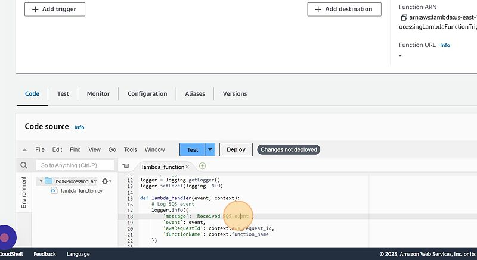

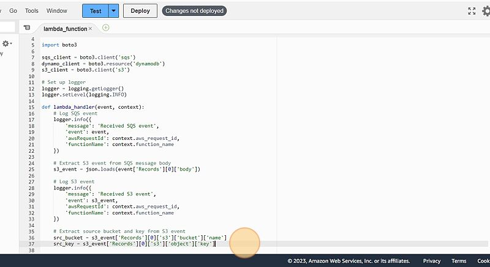

- Click "Deploy"

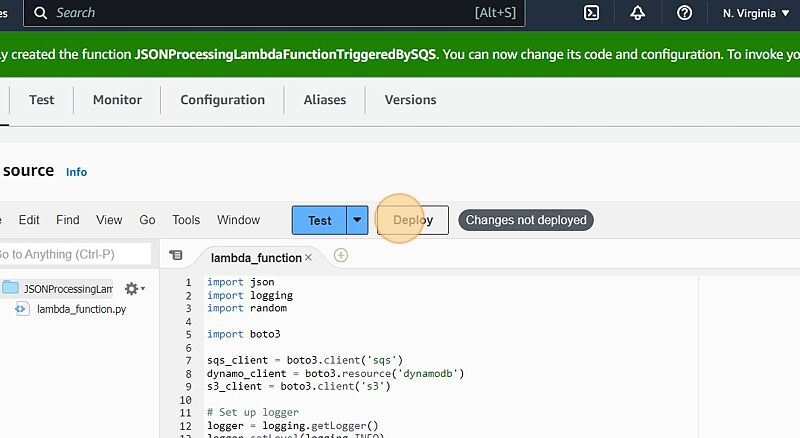

## Application integration

Here we would like to a queue which will take the input from S3 bucket and pass it to our Lambda function.

To have high resilience we will also have a **dead-letter queue** which will be containing all the json which are not processed properly. We will have a retention of 14 days for those json items.

### Creating dead-letter queue

- Click "Services"

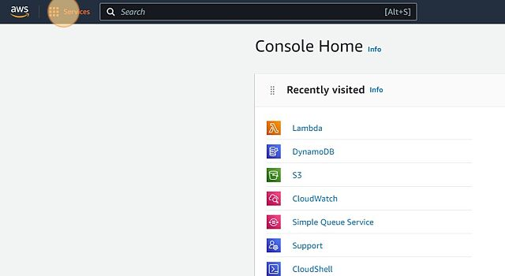

- Click "Application Integration"

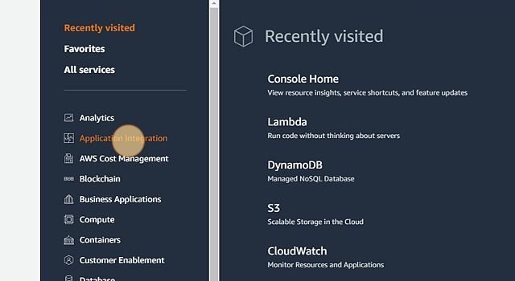

- Click "Simple Queue Service"

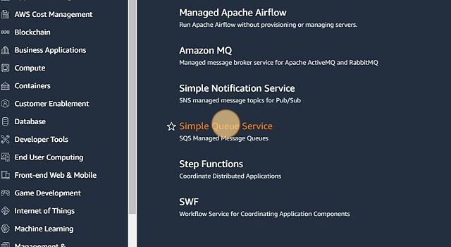

- Click "Create queue"

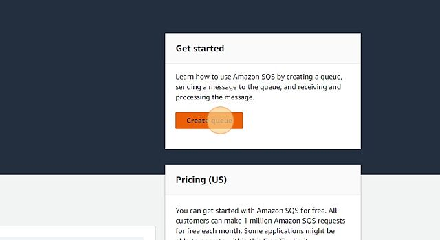

- Provide a name to dead-letter queue. Here I am giving it a name "JSONDeadLetterQueue"

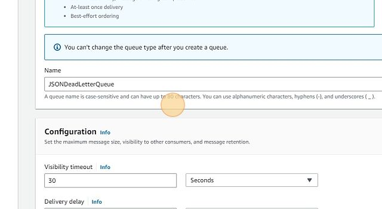

- We can also set the retention policy. For now I am setting it to 14 days.

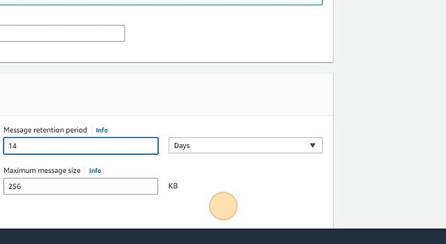

- Click "Create queue".

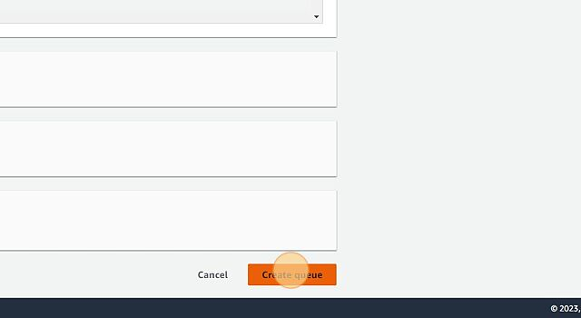


### Create queue for S3 bucket event notification

- Click back "Queue"

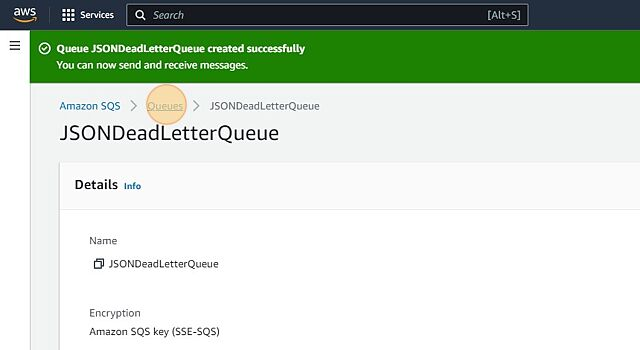

- Click "Create queue" again.

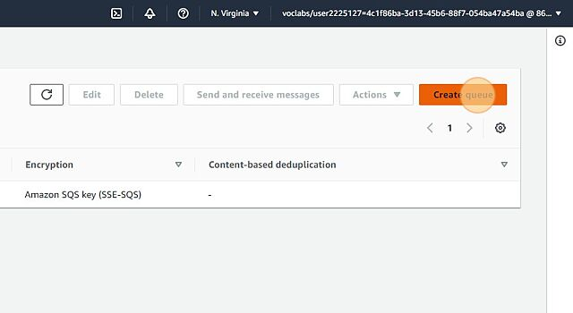

- Set the name for the queue. I am naming it "JSONProcessingQueue".

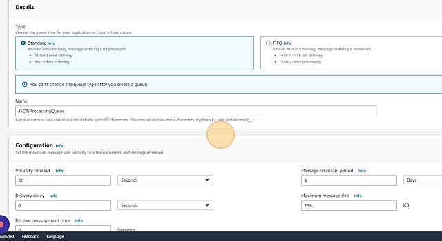

- Next step will be to modify the access policy for the queue. For this you will need the account ID as well as the S3 bucket name. You can get the account ID under the profile name.

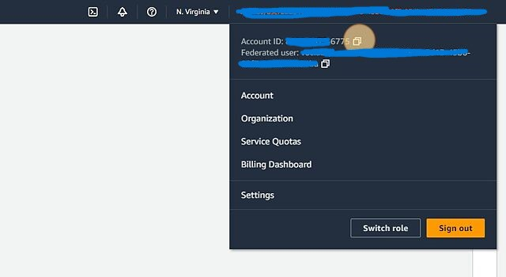

- Under "Access policy" click on "Advanced" and paste the following json. 



Please note that you will have to modify it as per your account name and S3 bucket name.



```json
{
  "Version": "2012-10-17",
  "Id": "JSONProcessingQueue-ID",
  "Statement": [
    {
      "Sid": "JSONProcessingQueue-statement-ID",
      "Effect": "Allow",
      "Principal": {
        "AWS": "*"
      },
      "Action": "SQS:SendMessage",
      "Resource": "arn:aws:sqs:us-east-1:CHANGE-WITH-YOUR-ACCOUNT-ID:JSONProcessingQueue",
      "Condition": {
        "StringEquals": {
          "aws:SourceAccount": "CHANGE-WITH-YOUR-ACCOUNT-ID"
        },
        "ArnLike": {
          "aws:SourceArn": "arn:aws:s3:*:*:CHANGE-WITH-YOUR-BUCKET-NAME"
        }
      }
    }
  ]
}

```

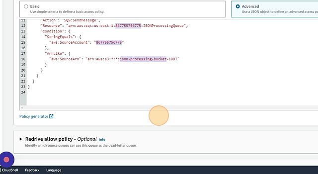

- Select the dead-letter queue we had created in the previous section.

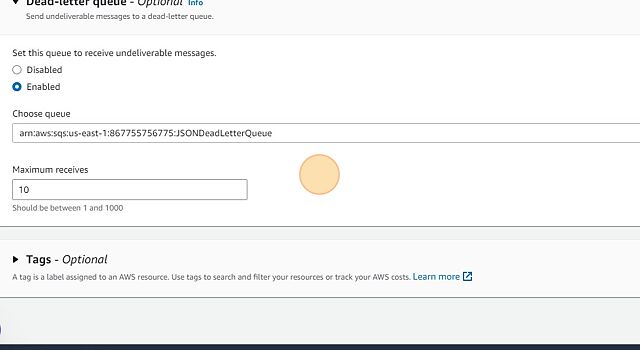

- Click "Create queue"

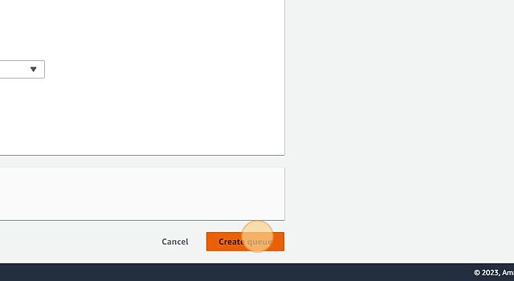

- Click "Lambda triggers"

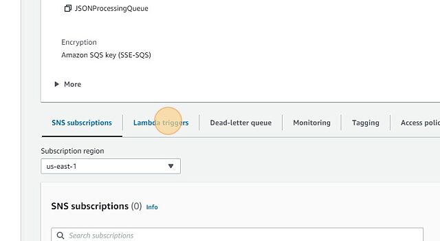

- Click "Configure Lambda function trigger"

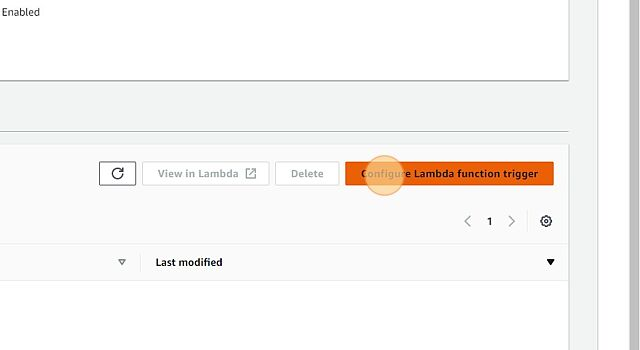

- Select the lambda function which we created before.

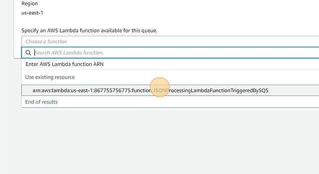

- Click "Save"

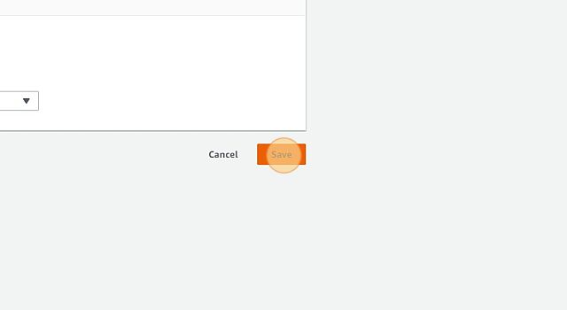

## Push event notification from S3 to SQS

- Click "Services"

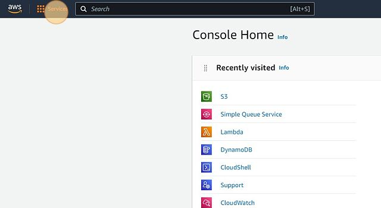

- Click "Storage"

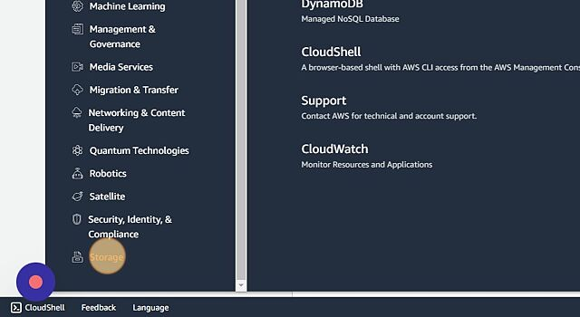

- Click "S3"

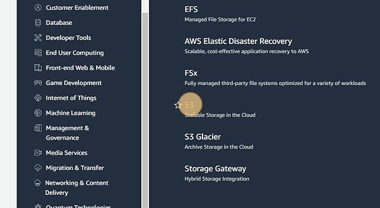

- Click "json-processing-bucket" (Your bucket name might be different)

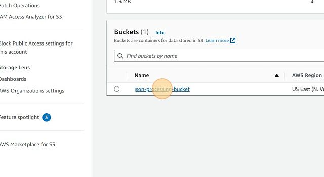

- Click "Properties"

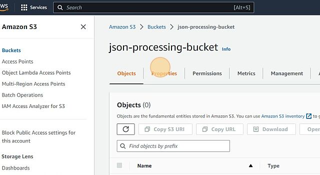

- Click "Create event notification"

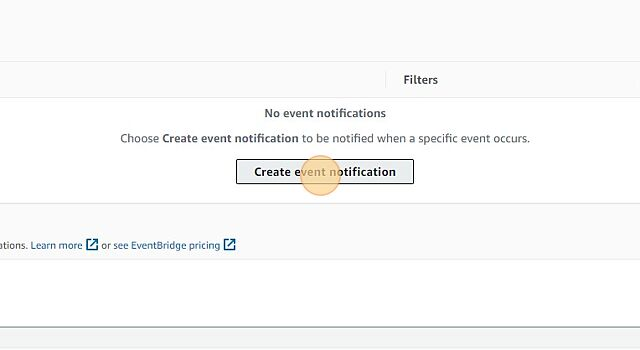

- Give the event notification a name. I have give name as "sqs-event-notification". Also I have given access to All object creation. So anytime a new object is pushed to S3, it will trigger a event to the SQS.

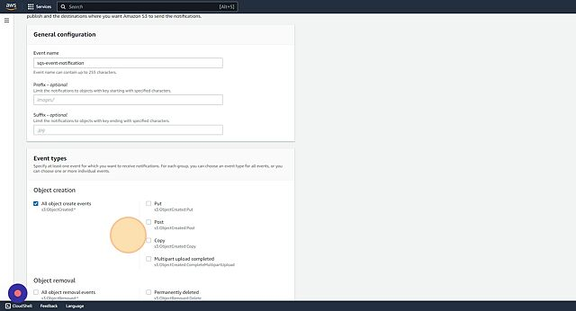

- We can link the SQS under "Destination"

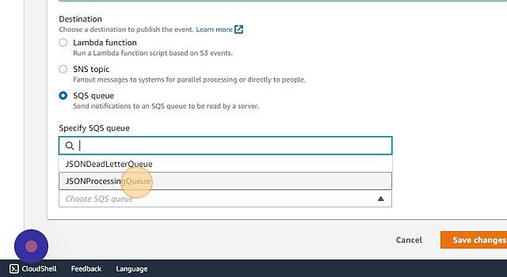

- Click "Save changes"

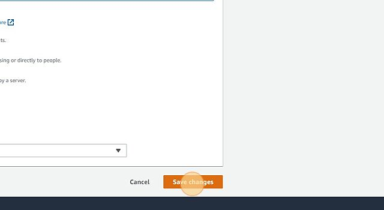

## Try out to see if the DynamoDB database is getting updated on new push

- Click "Services"

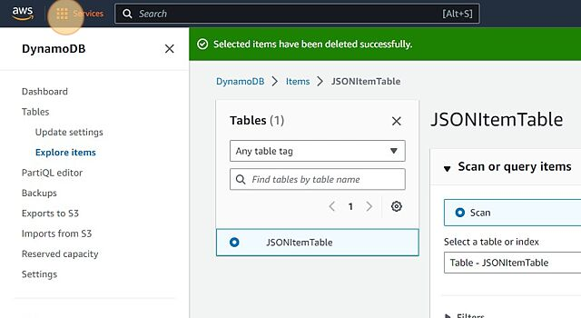

- Click "Storage"

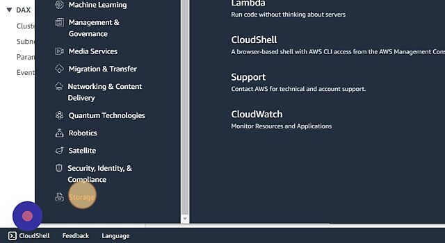

- Click "S3"

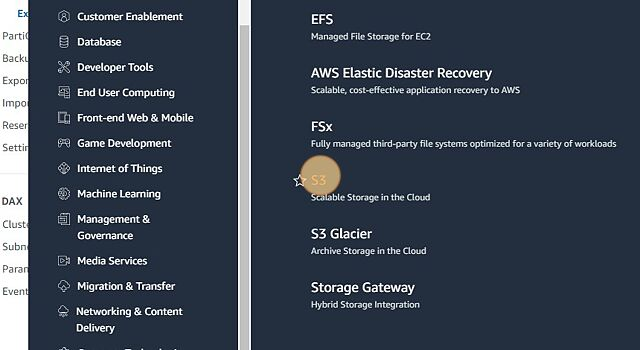

- Click "json-processing-bucket"

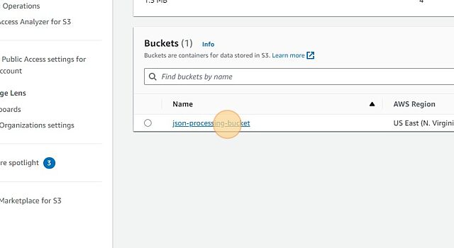

- Click "Upload"

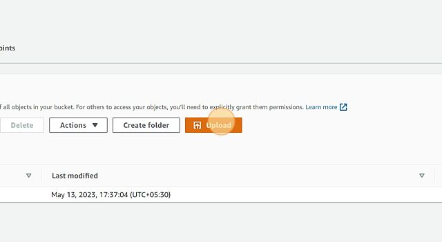

- Click "Add files"

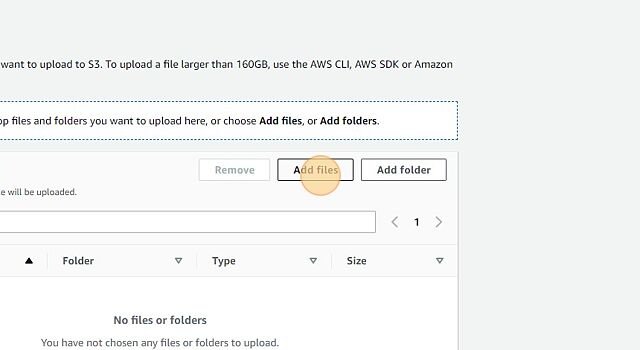

- Click "Upload" and select the file. For demostration purpose try to upload a valid JSON file

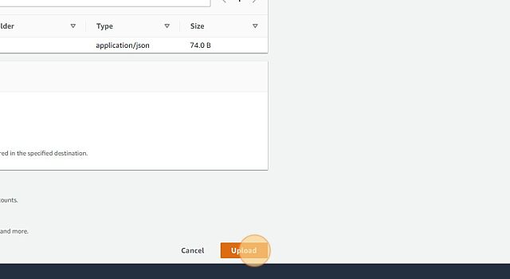

- Click "Services"


- Click "Database"

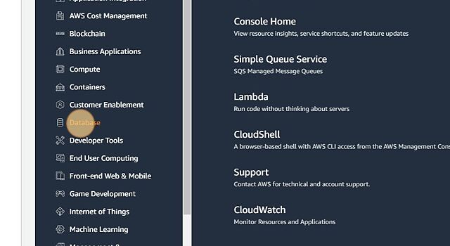

- Click "DynamoDB"

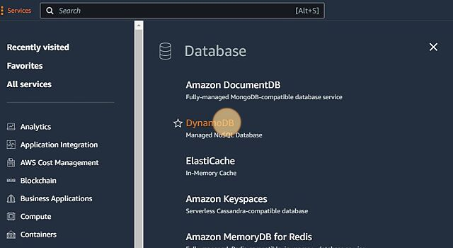

- Click "Tables"

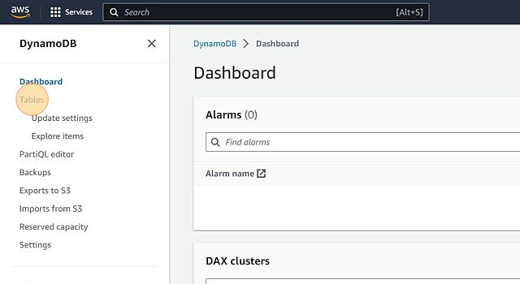

- Click "JSONItemTable"

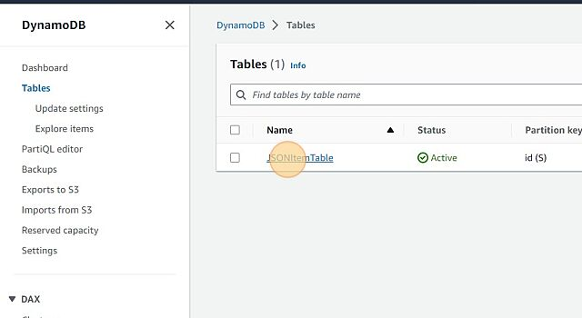

- Click "Explore table items"

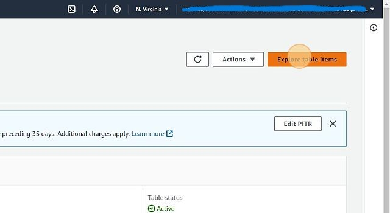

- Verify that the data is uploaded properly

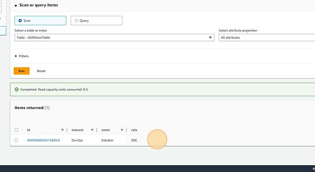


That covers the whole process of deploying a simple serverless application using AWS lambda.